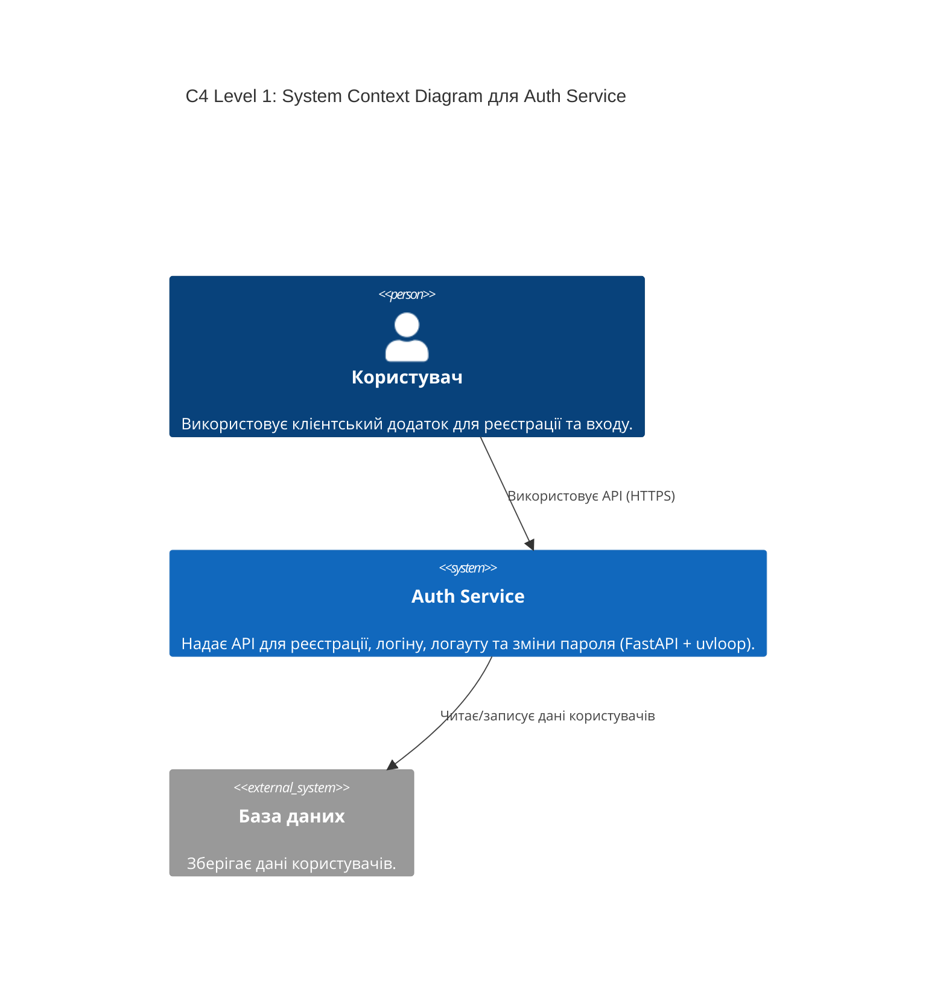

# C4 Model: Auth Service

## Level 1: System Context Diagram

```mermaid
C4Context
    title C4 Level 1: System Context Diagram для Auth Service

    Person(user, "Користувач", "Використовує клієнтський додаток для реєстрації та входу.")
    System(auth_service, "Auth Service", "Надає API для реєстрації, логіну, логауту та зміни пароля (FastAPI + uvloop).")
    System_Ext(db, "База даних", "Зберігає дані користувачів.")

    Rel(user, auth_service, "Використовує API (HTTPS)")
    Rel(auth_service, db, "Читає/записує дані користувачів")
```
